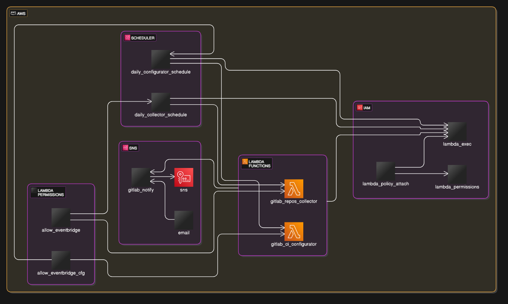

# 🧠 Automação GitLab com AWS Lambda e Terraform

## 📌 Introdução

Este documento descreve a automação com AWS Lambda, GitLab e Terraform para automatizar o gerenciamento de repositórios no GitLab, detectando mudanças
na lista de repositórios e ajustando configurações relacionadas ao CI/CD.
A solução automatiza o gerenciamento de repositórios no GitLab. Ela coleta diariamente a lista de repositórios a função Lambda (gitlab_repos_collector), compara as
mudanças com o estado anterior e notifica por e-mail via SNS caso haja alterações. A segunda função Lambda (gitlab_ci_configurator) verifica se os repositórios
possuem configurações de CI/CD habilitadas via .gitlab-ci.yml com base na lista armazenada no SSM anteriormente. Se o CI estiver configurado via Settings, o
arquivo é removido automaticamente, e um branch com uma solicitação de merge é criado para aplicar a mudança. O processo é agendado para rodar todos os dias
usando o EventBridge Scheduler, garantindo que as verificações ocorram regularmente. A solução utiliza o AWS Secrets Manager para armazenar o token de acesso
ao GitLab de uma conta de serviço previamente criada e o SSM Parameter Store para rastrear a lista de repositórios.
Todo o processo é construído em Terraform e Python.

Todo o processo é construído em Terraform e Python.

---

## ⚙️ Infraestrutura em Terraform

```shell
terraform-aws-gitlab-automation/
├── modules/
│   ├── iam/
│   │   ├── main.tf
│   │   ├── outputs.tf
│   │   └── variables.tf
│   ├── lambda/
│   │   ├── main.tf
│   │   ├── outputs.tf
│   │   └── variables.tf
│   ├── sns/
│   │   ├── main.tf
│   │   ├── outputs.tf
│   │   └── variables.tf
│   └── eventbridge/
│       ├── main.tf
│       ├── outputs.tf
│       └── variables.tf
├── lambdas/
│   ├── collector.py
│   ├── configurator.py
│   └── requirements.txt
├── main.tf
├── variables.tf
└── backend.tf

```
<br>
---

| Name | Monthly |   |   | Monthly Cost |
|----------|----------|----------|----------|----------|
| aws_kms_key.sns
├─ Customer master key           | 1  months  |      |   | $1.00    |
├─ Requests            |   |      |   | Monthly cost depends on usage: $0.03 per 10k requests  |
├─ ECC GenerateDataKeyPair requests           | requests   |      |   | Monthly cost depends on usage: $0.10 per 10k requests    |
└─ RSA GenerateDataKeyPair requests            | requests   |      |   | Monthly cost depends on usage: $0.10 per 10k requests    |
|<br>   |    |    |    |    |
| aws_lambda_function.gitlab_ci_configurator
├─ Requests           |    |      |   | Monthly cost depends on usage: $0.20 per 1M requests    |
└─ Duration            |   |      |   | Monthly cost depends on usage: $0.0000166667 per GB-seconds  |
|<br>   |    |    |    |    |
| aws_lambda_function.gitlab_repos_collector   
├─ Requests     |    |    |    |  Monthly cost depends on usage: $0.20 per 1M requests  |
└─Duration    |    |    |    | Monthly cost depends on usage: $0.0000166667 per GB-seconds    |                                                                                                            
|<br>   |    |    |    |    |                                                                                                           
| aws_sns_topic.gitlab_notify   
├─ Requests     |    |    |    |  Monthly cost depends on usage: $0.20 per 1M requests  |
└─ Duration    |    |    |    | Monthly cost depends on usage: $0.0000166667 per GB-seconds    |                                      
├─ API requests (over 1M)      |    |    |    | Monthly cost depends on usage: $0.50 per 1M requests     | 
├─ HTTP/HTTPS notifications (over 100k)      |    |    |    | Monthly cost depends on usage: $0.06 per 100k notifications    | 
├─ Email/Email-JSON notifications (over 1k)      |    |    |    | Monthly cost depends on usage: $2.00 per 100k notifications    | 
├─ Kinesis Firehose notifications      |    |    |    | Monthly cost depends on usage: $0.19 per 1M notifications     | 
├─ Mobile Push notifications       |    |    |    | Monthly cost depends on usage: $0.50 per 1M notifications   |  
├─ MacOS notifications       |    |    |    | Monthly cost depends on usage: $0.50 per 1M notifications    | 
└─ SMS notifications (over 100)       |    |    |    | Monthly cost depends on usage: $0.00 per 100 notifications   |                                                                                                            
                                                      
<br>               
                                                                                                            
 OVERALL TOTAL                                                                                        $1.00 
───────────────────
12 cloud resources were detected:<br>
∙ 4 were estimated, 3 of which include usage-based costs, see https://infracost.io/usage-file<br>
∙ 6 were free, rerun with --show-skipped to see details<br>
∙ 2 are not supported yet, rerun with --show-skipped to see details<br>

